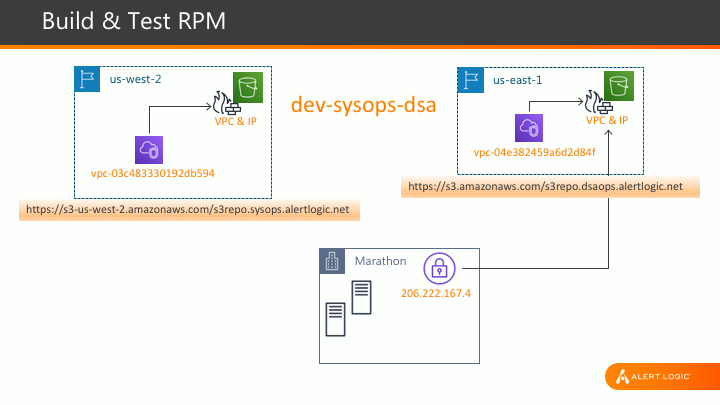
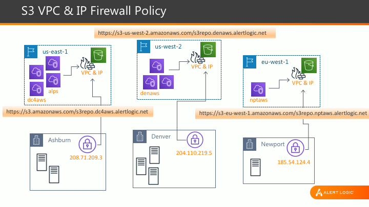

# alertlogic al-ruby26-el7 rpm for centos7/amzn2

### to create a new RPM
1. create a new **unintialized** repo at https://github.com/organizations/alertlogic/repositories/new
```bash
export MYREPO= _new repo name_
git clone git@github.com:alertlogic/al-ruby26-el7.git ${MYREPO}
cd ${MYREPO}
```
2. search and replace al-ruby26-el7 with ${MYREPO}
```bash
# macos bsd sed: LC_ALL=C find . -not -path '*/\.*' -type f -name "*" -exec sed -i '' "s/al-ruby26-el7/${MYREPO}/g" {} +
# macos gnu sed: find . -not -path '*/\.*' -type f -name "*" -exec gsed -i "s/al-ruby26-el7/${MYREPO}/g" {} +
find . -type f -name "*" -exec sed -i "s/al-ruby26-el7/${MYREPO}/g" {} +
mv SPECS/al-ruby26-el7.spec SPECS/${MYREPO}.spec
mv SOURCES/al-ruby26-el7 SOURCES/${MYREPO}
mv SOURCES/${MYREPO}/etc/default/al-ruby26-el7 SOURCES/${MYREPO}/etc/default/${MYREPO}
mv SOURCES/${MYREPO}/usr/local/share/al-ruby26-el7 SOURCES/${MYREPO}/usr/local/share/${MYREPO}
mv SOURCES/${MYREPO}/usr/local/sbin/al-ruby26-el7-config.sh SOURCES/${MYREPO}/usr/local/sbin/${MYREPO}-config.sh
rm -rf .git
git init
git add .
git commit -m 'initial release'
git remote add origin git@github.com:alertlogic/${MYREPO}.git
git push -u origin master
git tag 1.0
git push --tags
```

### to register repo and deploy with codebuild
```bash
# to register repo
aws --region=us-east-1 --profile=dev-sysops-dsa cloudformation create-stack --stack-name ${MYREPO} --template-body file://pipeline_cfn.yml --capabilities CAPABILITY_NAMED_IAM

# to deploy to integration
aws --region=us-east-1 --profile=dev-sysops-dsa codebuild start-build --project-name ${MYREPO}

# to deploy to all mirrors, including production
aws --region=us-east-1 --profile=dev-sysops-dsa codebuild start-build --project-name ${MYREPO} --environment-variables-override name=PROD_RELEASE,value=RFC,type=PLAINTEXT
```

### to register repo and deploy with alps
```bash
# to register repo
alps ci repo-register --github -o alertlogic -r ${MYREPO} -n 'https://outlook.office.com/webhook/18c4c8c7-ad31-440e-b0c6-76e057f5931b@04151827-cb2a-4231-9c24-1ef5ffc408eb/IncomingWebhook/c8e72eaec33149019ae7f83ef2277d03/a0496e76-55ef-456e-ac93-e39bab6f39e9'

# to deploy to integration
alps ci job-start --github -o alertlogic -r ${MYREPO} -t release --ref master

# to deploy to all mirrors, including production
alps ci job-start --github -o alertlogic -r ${MYREPO} -t release_rfc --ref master
```



### to test in dsaops or sysops VPC
```bash
sudo yum install http://s3repo.$(hostname -d)/el7/RPMS/noarch/al-s3repo-latest.rpm
sudo yum install al-ruby26-el7
```

### to test in marathon
```bash
sudo yum install https://s3.amazonaws.com/s3repo.dsaops.alertlogic.net/el7/RPMS/noarch/al-s3repo-latest.rpm
sudo yum install al-ruby26-el7
```

### to use RPM in alps AMI
```bash
BOOTSTRAP=true yum install -y https://s3.amazonaws.com/s3repo.dc4aws.alertlogic.net/el7/RPMS/noarch/al-s3repo-latest.rpm
BOOTSTRAP=true yum install -y al-ruby26-el7
yum clean all && rm -rf /var/cache/yum
```



# developer notes
* rpm versioning is handled by git automagically (git describe --tags --long)
* the latest commit creates an rpm revision that obsoletes previous ones (older revisions will still be available)
* do not pin revisions in your cfn/chef recipes unless absolutely necessary (it breaks compliance)
* do not manually deploy rpms directly to mirrors (bad things will happen)
* never run createrepo or anything similar (bad things will happen)

### notable RPMs and locations
* al-s3repo - https://github.com/alertlogic/s3repomaster
* al-ldap - https://github.com/alertlogic/al-ldap
* al-sensu-client - https://github.com/alertlogic/al-sensu-client
* al-datadog-7 - https://github.com/alertlogic/al-datadog-7
* al-base - https://github.com/alertlogic/al-base
* al-base-devel - https://github.com/alertlogic/al-base-devel
* al-ossec - https://github.com/alertlogic/al-ossec
* al-td-agent - https://github.com/alertlogic/al-td-agent
* al-aws - https://github.com/alertlogic/al-aws
* al-set-hostname - https://github.com/alertlogic/al-set-hostname
* al-goofys - https://github.com/alertlogic/al-goofys

### development RPMS
* al-python3 - https://github.com/alertlogic/al-python3
* al-ruby23-el7 - https://github.com/alertlogic/al-ruby23-el7
* al-ruby24-el7 - https://github.com/alertlogic/al-ruby24-el7
* al-nodejs12-el7 - https://github.com/alertlogic/al-nodejs12-el7

### service RPMs
* al-sensu-server-el7 - https://github.com/alertlogic/al-sensu-server-el7
* al-mysql-el7 - https://github.com/alertlogic/al-mysql-el7
* al-mysql57-el7 - https://github.com/alertlogic/al-mysql57-el7
* al-riak14-el6 - https://github.com/alertlogic/al-riak14-el6

### to test rpm build in docker
* see docker file in docker folder

### integration mirror list
* yum install https://s3-us-west-2.amazonaws.com/s3repo.syops.alertlogic.net/el7/RPMS/noarch/al-s3repo-latest.rpm   # us-west-2 (dev-sysops-dsa vpc-04e382459a6d2d84f)
* yum install https://s3.amazonaws.com/s3repo.dsaops.alertlogic.net/el7/RPMS/noarch/al-s3repo-latest.rpm            # us-east-1 (dev-sysops-dsa vpc-03c483330192db594)

### production mirror list
* yum install https://s3.amazonaws.com/s3repo.dc4aws.alertlogic.net/el7/RPMS/noarch/al-s3repo-latest.rpm            # us-east-1 (ashburn, alps)
* yum install https://s3-us-west-2.amazonaws.com/s3repo.denaws.alertlogic.net/el7/RPMS/noarch/al-s3repo-latest.rpm  # us-west-2 (denver)
* yum install https://s3-eu-west-1.amazonaws.com/s3repo.nptaws.alertlogic.net/el7/RPMS/noarch/al-s3repo-latest.rpm  # eu-west-1 (newport)
